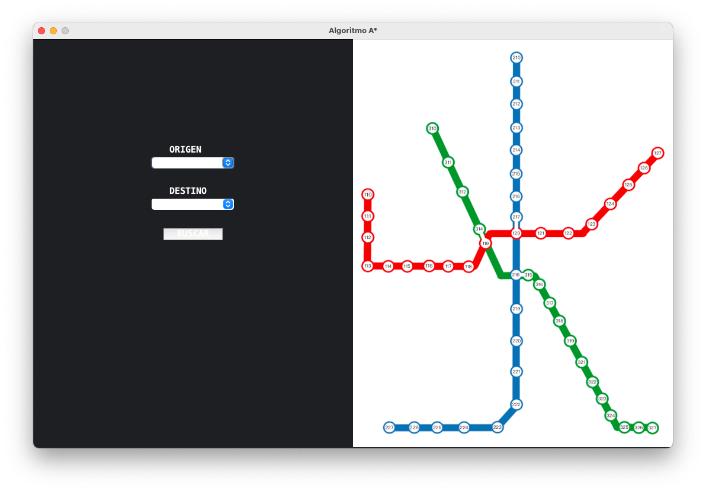

# A* visualisation of the shortest route in a metro network

Project developed for the Artificial Intelligence course of the Polytechnic University of Madrid in 2022.

The system lets the user choose the origin and destination of the route and displays the shortest route, time and distance.
